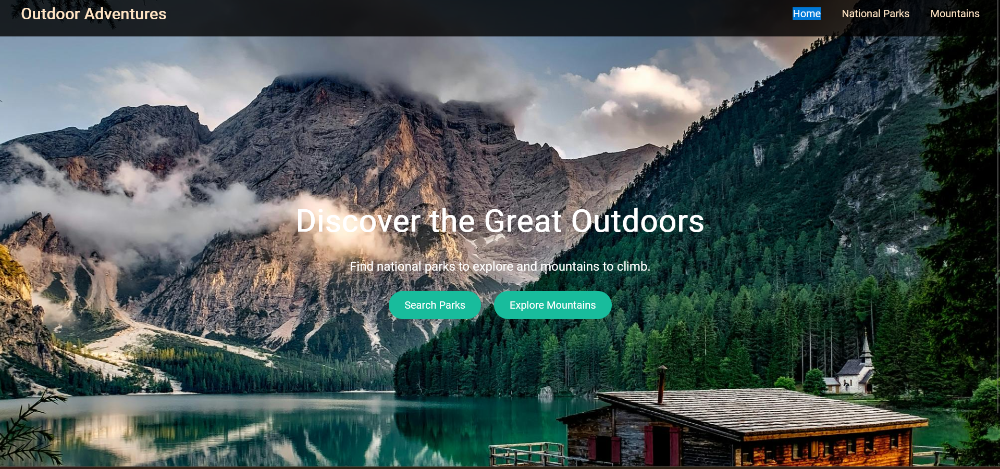
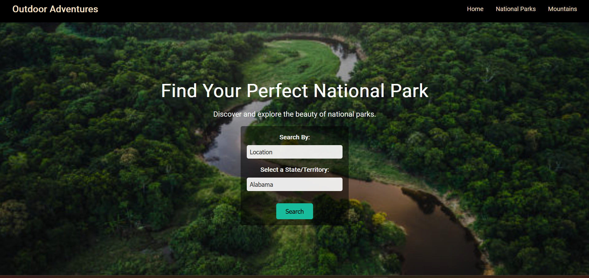
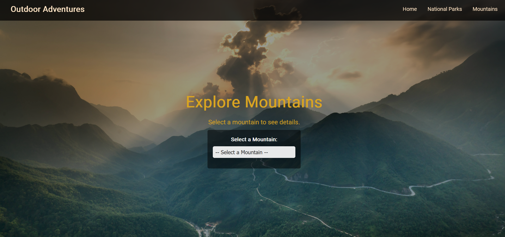

Outdoor Adventures Website

Table of Contents

• Introduction • Features • Demo • Installation • Usage • Project Structure • Technologies Used • Contributing • License • Contact

Introduction

Outdoor Adventures is an interactive and informative website designed to inspire and assist outdoor enthusiasts in exploring various natural wonders. The site offers detailed information about national parks, mountains, and other outdoor destinations, complete with images, descriptions, and relevant data such as elevation and sunrise/sunset times.

Features

• Home Page:

Engaging hero section with dynamic background images. Introduction to the website’s purpose and offerings.

• Parks Page:

Comprehensive list of national parks with details. Search and filter functionality to find parks based on criteria. Images and descriptions for each park.

• Mountains Page:

Interactive dropdown to select and view detailed information about various mountains. Display of elevation, difficulty level, descriptions, and images. Real-time sunrise and sunset times fetched based on mountain coordinates.

• Responsive Design:

Optimized for various devices and screen sizes, ensuring a seamless user experience on desktops, tablets, and mobile devices. Smooth Transitions and Animations: Enhances user engagement with visual effects like fade-ins and hover animations.

• Accessibility:

Designed with accessibility in mind, including proper alt texts for images and keyboard navigability.

Installation

Follow these steps to set up the project locally on your machine.

Prerequisites

• Web Browser: Latest version of Chrome, Firefox, Edge, or Safari. • Local Server: To run the project locally and avoid CORS issues.

Steps

    Clone the Repository:

git clone https://github.com/Narel-y/Capstone-project-2

    Navigate to the Project Directory:

cd outdoor-adventures

    Start a Local Server: You can use Python’s SimpleHTTPServer or any other local server of your choice. • Using Python 3:

python -m http.server 8000

• Using Python 2:

python -m SimpleHTTPServer 8000

• Using Node.js (http-server): First, install http-server globally if you haven’t:

npm install -g http-server

Then, start the server:

http-server -p 8000

    Open the Application in Your Browser: Navigate to http://localhost:8000/index.html in your web browser.

Usage

    Explore the Home Page: • Get an overview of the website and its offerings. • Navigate to different sections using the navigation bar.
    Browse National Parks: • Visit the National Parks page to explore a curated list of parks. • Use the search and filter options to find parks that match your interests. • Click on a park to view detailed information, including images and descriptions.
    Discover Mountains: • Go to the Mountains page to select a mountain from the dropdown menu. • Click the “Search Mountain” button to view detailed information about the selected mountain, including elevation, difficulty, description, and images. • View today’s sunrise and sunset times for the mountain’s location.
    Responsive Navigation: • Use the hamburger menu on smaller screens to navigate through the website seamlessly.

Project Structure

outdoor-adventures/ 

├── images/ │
 ├──  │ All Mountain Images |

  ├──img2/ |
     ├── Background Images

 
 ├── js/ │
   ├── mountainsData.js │
   ├── mountains.js │ 
   ├── nationalParksData.js │ 
   └── nationalParks.js 
   
   ├── css/ │ 
    ├── style.css │
    ├── mountains.css │ 
    └── nationalParks.css 
   
   ├── index.html
    ├── national-parks.html 
    ├── mountains.html 
    
    ├── README.md
     └── LICENSE

• images/: 

Contains all image assets used across the Mountain Search Information. 

• js/: 

Contains JavaScript files for data and functionality. 

• mountainsData.js: 

Holds the local data array for mountains. 

• mountains.js: 

Contains all the JavaScript logic for the Mountains page. 

• nationalParksData. js:

 Holds the local data array for national parks. 
 
 • nationalParks.js: 
 
 Contains all the JavaScript logic for the National Parks page. 
 
 • css/:
 
  Contains stylesheets for the project. 
  
  • Home.css: 
  
  Global styles applied across all pages. 
  
  • mountains.css: 
  
  Styles specific to the Mountains page. 
  
  • Park.css:
  
   Styles specific to the National Parks page. 
   
   • index.html: 
   
   The main landing page of the website.
   
    • parks.html: 
    
    The National Parks information page. 
    
    • mountains.html: 
    
    The Mountains information page. 
    
    • README.md: 
    
    Documentation for the project. 
    
    • LICENSE:
    
     License information for the project.

Technologies Used

• HTML5 & CSS3: 

For structuring and styling the web pages. 

• JavaScript (ES6):

 For dynamic functionality and API interactions. 
 
 • Fetch API: 
 
 To retrieve sunrise and sunset times from the Sunrise-Sunset API. 
 
 • Google Fonts:
 
  For enhanced typography.
 
  • Font Awesome: 
  
  For icons and visual enhancements. 
  
  • Responsive Design Principles: 
  
  Ensuring compatibility across various devices and screen sizes. • CSS Flexbox & Grid: For layout management. • Git & GitHub: For version control and collaboration.

Contributing

Contributions are welcome! If you’d like to improve this project, please follow these steps:

    Fork the Repository: 
    
    Click the “Fork” button at the top right of the repository page to create a copy of the project.
    Create a New Branch:

git checkout -b feature/YourFeatureName

    Make Your Changes: 
    
    Implement your feature or fix bugs as needed.
    Commit Your Changes:

git commit -m "Add some feature"

    Push to the Branch:

git push origin feature/YourFeatureName

    Open a Pull Request: Navigate to the original repository and click the “Compare & pull request” button to submit your changes for review.

License

This project is licensed under the Yearup United License.

Contact

For any questions, suggestions, or feedback, please contact me at: 

• Email: 

nareloffical@gmail.com

Developed with ❤️ by Narel.y
